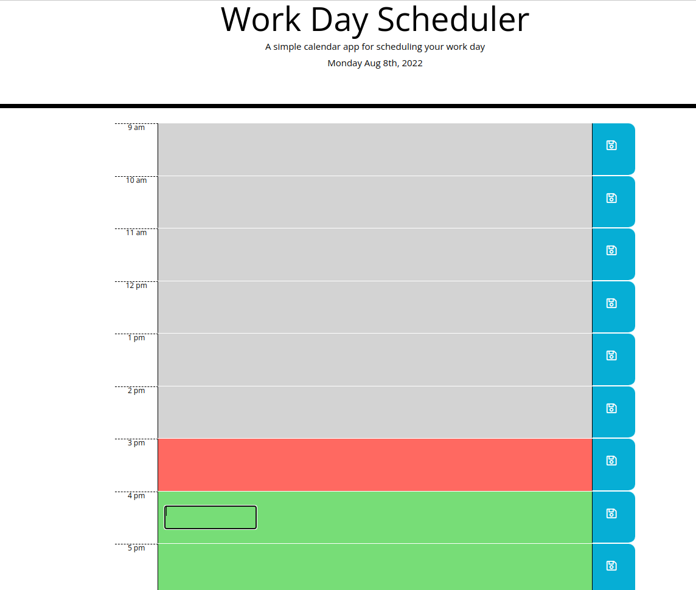

## Work Schedule Planner 
In the beginning, css and html file were provided. The purpose of this assignment is to refactory and build code to make the work planner run in the browser and feature dynamically updated HTML and CSS powered by jQuery. To have planner update with the current time and date, Moment.js library was used.

## Website Screenshot
This is what the website needs to look like after fixing the starter html and css file and creating the js file.

## How Code Was Refractored
* Making the schedule dynamic using Moment.js
* Adding and calling functions to help perform a certain task.
* Using getItem and setItem save event in the local storage and displaying on the browser.
* Using objects, for loops, and if else statements to change the background color of the hour slots.
* Using bootstrap, helps design websites faster and easier (i.e., it takes care of flex box). 

## How to deploy the link application
* Click on this link for deployed application
* https://github.com/mstan19/dailyPlannerMS

